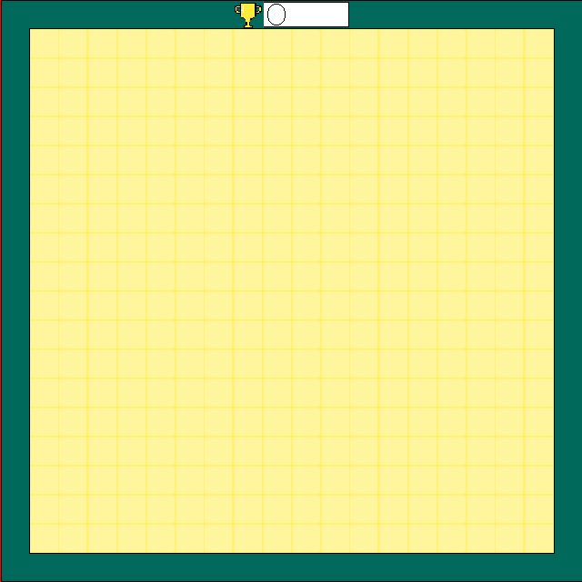
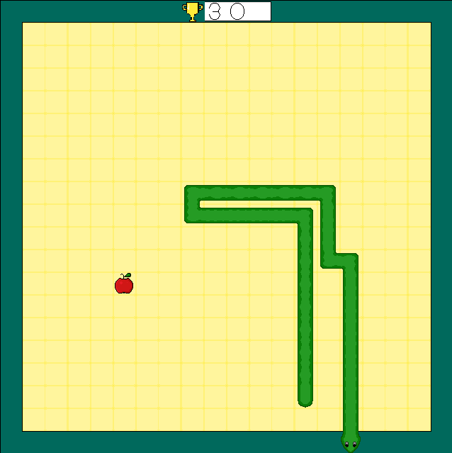

# Haskell-Snake

A implementation of the ancient Snake game made in Haskell using the [gloss-game](http://hackage.haskell.org/package/gloss-game) package.

## Running

Assuming you have the [cabal](https://www.haskell.org/cabal/) tool at the latest version, just run `cabal new-run` should download dependencies, build and run the game.

Some system dependencies will be necessary to build the game, just follow cabal's tips if build fails.

## Commands

- `Esc` closes the game;
- `Enter` start a new game if not already running;
- `Arrows` control the Snake;

## Screenshots:

